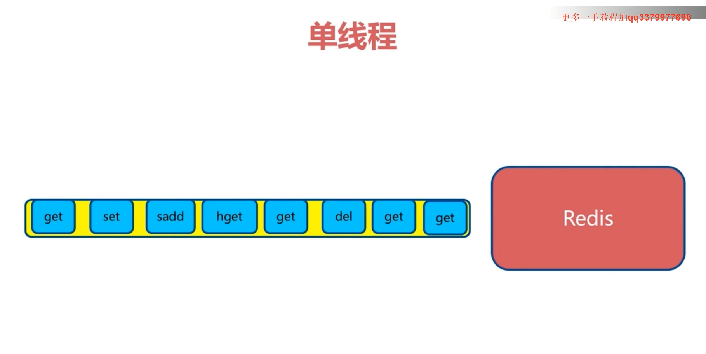

# Redis为什么这么快
## 0.Redis是单线程的(命令执行是单线程的)
+ 
- Redis在一个瞬间，只能执行一条命令。所以(**Redis命令都是原子操**)：
    1. 一次只运行一条命令
    2. 拒绝慢命令（慢命令: keys , flushall）
    3. 内部其实不是单线程的，像RDB持久化时，会fork一个进程出来进行持久化

### Redis单线程为什么这么快
1. 纯内存操作
2. 非阻塞I/O
    - 多路I/O复用模型
3. 避免上下文切换，避免加锁 
    - 采用单线程，避免了不必要的上下文切换和竞争条件，也不存在多进程或者多线程导致的切换而消耗 CPU，不用去考虑各种锁的问题，不存在加锁释放锁操作，没有因为可能出现死锁而导致的性能消耗；
4. 数据结构优化
    - 数据结构简单，对数据操作也简单，Redis中的数据结构是专门进行设计的；
5. 优化的操作： Redis 对常用操作进行优化，如批量操作和管道技术，减少了网络通信开销。

----------------------

