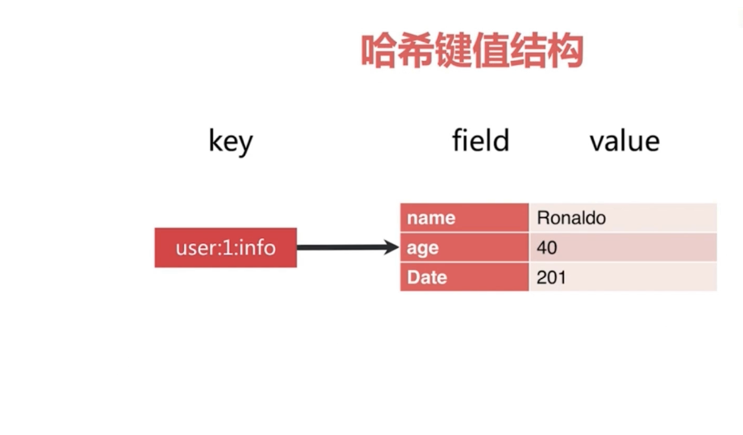
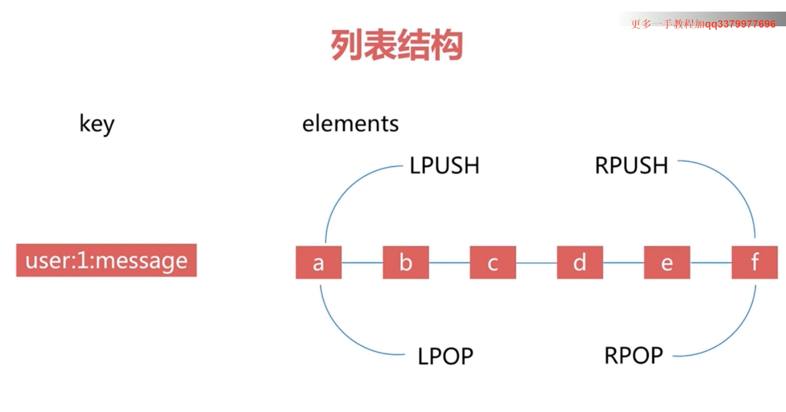
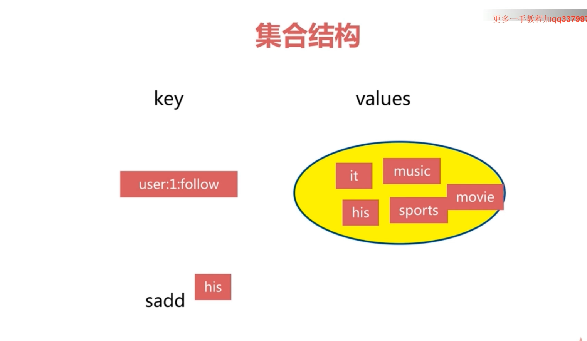
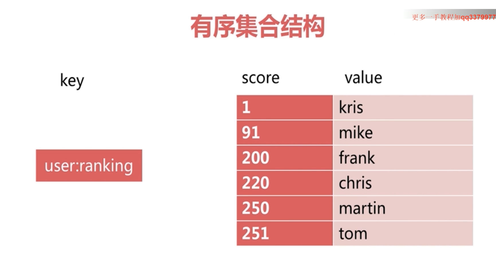

# Redis 通用命令和理解
&nbsp;&nbsp;主要需要了解： 1. 有哪些数据结构；2.各种数据结构有着什么样的使用场景；

## 1. 通用命令
1. keys [pattern]: 遍历所有的Key,不建议在生产环境用
    - 命令比较重，O(n),Redis是单线程的，会阻塞其他的命令
    - 没有意义，实在需要，使用scan命令
2. dbsize : 查看数据库大小（Redis有一个计数器，所以这个命令是O(1)）
    - 算出Key的总数
3. exists key : 判断Key是否存在（操作时间复杂度:O(1)）
    - 判断Key是否存在
4. del key [key ..] : 删除Key（操作时间复杂度:O(1)）
    - 删除指定的k-v , 可以同时删除多个
5. expire key seconds : 设置过期时间（操作时间复杂度:O(1)）
    - expire key seconds: key在seconds秒后过期,那毫秒怎么设置？ （操作时间复杂度:O(1)）
    - ttl key : 查看key剩余的过期时间（操作时间复杂度:O(1)）
    - persist key: 去掉Key的过期时间（操作时间复杂度:O(1)）
6. type key :查看数据类型（操作时间复杂度:O(1)）
    - 返回key的类型
## 2. 数据结构和内部编码
1. string
2. hash
3. list
4. set
5. zset   

### RedisObject

### Redis基础数据结构之string
&nbsp;&nbsp;注意事项：
1. 字符串大小为512MB

|存储类型|Key|Value|
|---|---|---|
|存字符串|hello|world|
|存数字,会有类型转换操作|counter|1|
|存二进制|bits|10111101|

### string使用场景
1. 缓存
2. 计数器
3. 分布式锁
4. 。。。。。

#### string命令
- get key: 获取key对应的value
- set key value： 设置key-value 
- incr key: key自增1，如果key不存在，自增后get(key)=1=，即当key不存在则会创建这个key，并赋值为0，再自增1
- decr key: key自减1，若key不存在，自减后get(key)=-1
- incrby key k:key 自增k，若key不存在，自增后get(key)=k
- decrby key k:key 自减少k，若key不存在，自减后get(key)=-k
- set key value: 不管key是否存在，都设置
- setnx key value: key不存在才设置，可能会返回设置失败(可实现分布式锁)
    - setnx: SET if Not eXists
- set key value xx: key存在，才设置。(相当于更新操作)
- mget key1 key2 key3 ....: 批量获取key，原子操作(O(n))
    - 相比于get操作，节省了网络I/O.(通过一次网络获取n个key)
- mset k1 v1 k2 v2 k3 v3 : 批量设置key-value(O(n))
- getset key newValue: set key newvalue并返回旧的value
- append key value: 将key追加到旧的value.(当key不存在，会创建这个key)
- strlen key: 返回字符串的长度，注意中文

----------------
### hash
&nbsp;&nbsp;还是key-value结构，但是value结果分为两部分:field , value
   - 
#### hash命令(格式: hxx)
1. hget: hget key field 获取hash key对应的field的value
2. hset: hset key field value: 设置hash key对应的field的value
3. hdel: hdel key field 删除hash key 对应的field的value
4. hexists: hexists key field 判断hash key是否有field
5. hlen： hlen key 获取hash key field的数量
6. hmget key field1 field2 ...fieldn: 批量获取key的一批field对应的值
7. hmset key field1 value1 field2 value2 ...fieldn valuen： 批量设置key 的一批field value
8. hgetall key: 返回hash key对应所有的field和value
9. hvals key： 返回hash key对应所有的field和value
10. hkeys key: 返回hash key对应所有的field
11. hsetnx key field value: 设置hash key对应field的value(若field已经存在，则失败,即当不存在时才设置)
12. hincrby key field inCounter: hash key对应的field的value自增intCounter
13. hincrby float key field floatCounter: hinrby 浮点数版本

#### hash应用场景
1. 电商购物车
    - key为用户id，field为商品id，value为数量
2. 存储对象
    - key为对象id， field为对象属性 ， value为属性值    

----------------
### list
&nbsp;&nbsp;列表结构：
- 
 
  + lpush: 从左入队
  + lpop： 弹出左边第一个元素
  + rpush： 从右入队
  + rpop： 弹出右边第一个元素

#### list特点
1. 有序（插入的顺序）
2. 可以重复
3. 左右两边插入和弹出

#### list命令
1.  lpush key value1 value2 value3....valueN: 从列表左边插入值(1~N个)
2. linsert key before|after value  newValue: 在**指定的值**前|后插入newValue
     - list允许值重复，值重复时如何处理?
3. lpop key:从左边弹出一个元素
4. rpop key:从右边弹出一个元素
5. lrem  key count value: 根据count值，从列表中删除所有value相等的项
    - count>0,从左到右，删除最多count个value相同的项
    - count<0,从右到左，删除最多Math.abs(count)个value相等的项目
    - count=0 , 删除所有的value相等的项
6. ltrim key start end: 按照索引范围修剪列表   
    - 列表从左到右,共n个元素，下标值: 0 ~ n-1，ltrim k1 1 4:保留下标1~4的元素，其他的删除掉。
    - 用处是： 非常大的list的删除操作，此时不能直接del，需要逐步裁剪，直到达到删除的效果
7.  lrange key start end(包含end)： 获取列表指定索引范围所有item
8. lindex key index: 获取列表中index个元素
    - 获取第一个元素： lindex k1 0
    - 获取最后一个元素: lindex k1 -1
9. llen key:算出列表的长度。
10. lset key index newValue： 设置列表指定索引值为newValue
11. blpop key timeout: lpop阻塞版本，timeout是阻塞超时时间，timeout=0为永不阻塞。

##### list使用场景
1. 关注人时间轴
2. lpush + lpop = stack
3. lpush + rpush = queue
4. lpush + ltrim = Cappen Collection
5. lpush + brpom = Message Queue
----------------
### set 
+ 

#### set命令
1. sadd key element: 向集合key中添加element(如果element存在，则添加失败)
2. srem key element:从集合key中删除元素element
3. scard key 计算集合大小
4. sismember key  ele1：判断ele1是否在集合中
5. srandmember key count:从集合中随机挑count个元素，**挑选，而不是删除**
6. spop key 从集合中随机弹出一个元素，**弹出后，就相当于是删除了**，返回值就是这个被弹出的元素
7. smembers key : 获取集合中所有的元素(注意Redis是单线程的，需要考虑集合元素多的问题，此时可以使用scan命令来获取所有的元素)
8. sdiff k1 k2 计算k1中有的，但是k2中没有的(差集)
9. sinter k1 k2 交集
10. sunion k1 k2 并集
11. SINTERSTORE  求交集，SINTERSTORE song_interset songs my_songs ， 求 songs 和 my_songs 的交集，并将交集存放到 song_interset 里面去,且类型也是set
#### set特点
1. 无序
2. 无重复
    ```log
     无重复是如何实现的? Redis 将存入的值包装为redisObj,每个redisObj方法都有对应的Compare方法，详细查看一下sadd命令的执行流程,堆栈如下:
     
         _dictKeyIndex(dict * d, const void * key, uint64_t hash, dictEntry ** existing) (/home/wei/WorkSpace/open_source/Redis/001.REDIS_SOURCE_CODE/redis-6.2.5/src/dict.c:1038)
         dictAddRaw(dict * d, void * key, dictEntry ** existing) (/home/wei/WorkSpace/open_source/Redis/001.REDIS_SOURCE_CODE/redis-6.2.5/src/dict.c:325)
         setTypeAdd(robj * subject, sds value) (/home/wei/WorkSpace/open_source/Redis/001.REDIS_SOURCE_CODE/redis-6.2.5/src/t_set.c:56)
         saddCommand(client * c) (/home/wei/WorkSpace/open_source/Redis/001.REDIS_SOURCE_CODE/redis-6.2.5/src/t_set.c:313)
         call(client * c, int flags) (/home/wei/WorkSpace/open_source/Redis/001.REDIS_SOURCE_CODE/redis-6.2.5/src/server.c:3717)
         processCommand(client * c) (/home/wei/WorkSpace/open_source/Redis/001.REDIS_SOURCE_CODE/redis-6.2.5/src/server.c:4242)
         processCommandAndResetClient(client * c) (/home/wei/WorkSpace/open_source/Redis/001.REDIS_SOURCE_CODE/redis-6.2.5/src/networking.c:2018)
         processInputBuffer(client * c) (/home/wei/WorkSpace/open_source/Redis/001.REDIS_SOURCE_CODE/redis-6.2.5/src/networking.c:2119)
         readQueryFromClient(connection * conn) (/home/wei/WorkSpace/open_source/Redis/001.REDIS_SOURCE_CODE/redis-6.2.5/src/networking.c:2205)
         callHandler(connection * conn, ConnectionCallbackFunc handler) (/home/wei/WorkSpace/open_source/Redis/001.REDIS_SOURCE_CODE/redis-6.2.5/src/connhelpers.h:79)
         connSocketEventHandler(struct aeEventLoop * el, int fd, void * clientData, int mask) (/home/wei/WorkSpace/open_source/Redis/001.REDIS_SOURCE_CODE/redis-6.2.5/src/connection.c:295)
         aeProcessEvents(aeEventLoop * eventLoop, int flags) (/home/wei/WorkSpace/open_source/Redis/001.REDIS_SOURCE_CODE/redis-6.2.5/src/ae.c:450)
         aeMain(aeEventLoop * eventLoop) (/home/wei/WorkSpace/open_source/Redis/001.REDIS_SOURCE_CODE/redis-6.2.5/src/ae.c:519)
         main(int argc, char ** argv) (/home/wei/WorkSpace/open_source/Redis/001.REDIS_SOURCE_CODE/redis-6.2.5/src/server.c:6396)
     ```
3. 集合间操作

#### set使用场景
1. 标签（例如共同关注）： 
   - sadd user:1:tag tag1 tag2 tag3...(给用户添加标签)
   - sadd tag1:users user1 user2...usern (给哪些人有这个标签)
2. 缓存IP白名单
   - 向IP白名单中添加元素: sadd ipWhiteList_${group_id}_${appKey} 127.0.0.1  192.168.8.1  192.168.8.2
   - 判断IP是否存在于白名单中: sismember ipWhiteList_${group_id}_${appKey} 127.0.0.1,若存在，则返回1；反之，返回0

----------------
### zset 
&nbsp;&nbsp;zset数据结构如下：
+ 

#### zset命令
1. zadd key score element(可以是多对): 添加score和element(O(logN))
2. zrem key element（可以多个）: 删除元素 
3. zscore key element： 返回元素的分数
4. sincrby key increscore element:增加或减少元素的分数(increscore为负数即减少)
5. zcard key： 返回元素的个数
6. zrank key element:返回元素的排名，从小到大排的
7. zrangebyscore key minscore maxscore: 返回指定分数范围内的升序元素
8. zcount key minScore maxScore: 返回指定分数范围内的元素个数
9. zremrangebyrank key start end ： 删除指定排名内的升序元素
10. zremrangebyscore key minScore maxScore:删除指定分数内的升序元素

#### zset场景
1. 关注量（收藏量），根据关注量来排序

#### zset与set对比
|比较维度|zset|set|备注|
|---|---|----|---|
|是否有重复元素|无重复元素|无重复元素|均没有重复元素|
|元素是否有序|有序|无序||
|元素类型|element + score|element|zset通过score来实现有序的|
