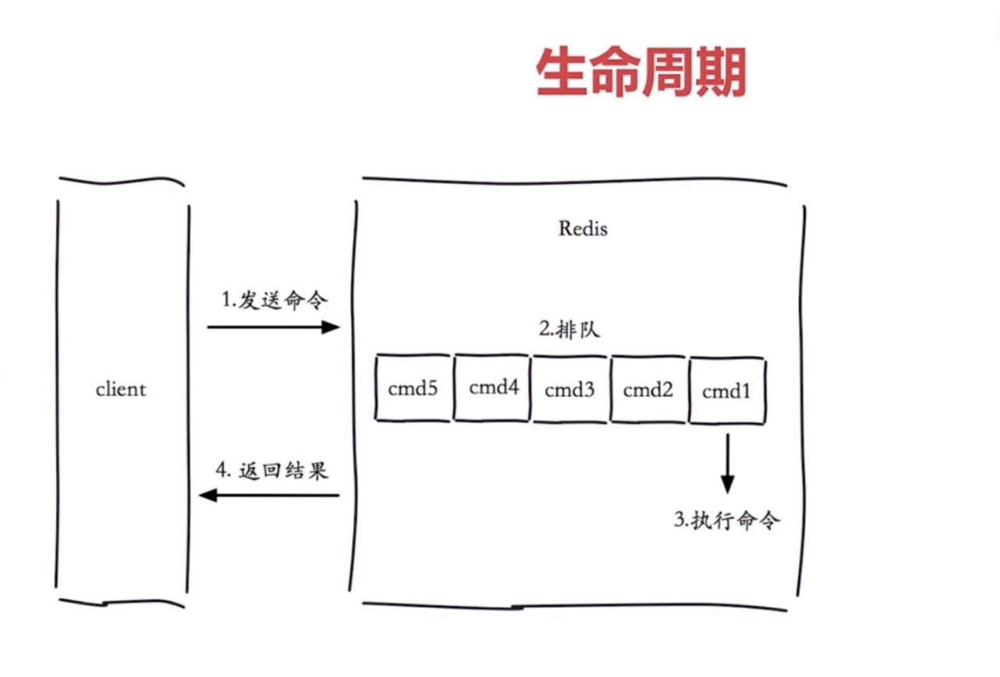
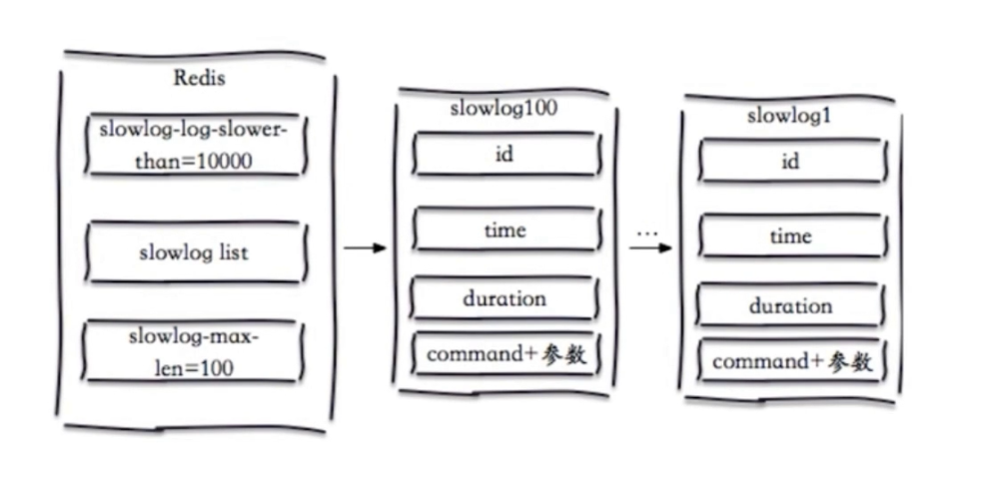

# Redis慢查询
&nbsp;&nbsp;Redis客户端请求Redis服务器的生命周期:
- 

&nbsp;&nbsp;慢查询
- 慢查询发生在第三个阶段，即命令执行本身
- 客户端超时不一定是慢查询，但慢查询是客户端超时的一个原因。

## 慢查询配置
- 
&nbsp;&nbsp;慢查询是
1. 先进先出队列
2. 固定长度
3. 保存在内存中

### 配置1. slowlog-max-len
&nbsp;&nbsp;慢查询队列长度

### 配置2. slowlog-log-slower-than
&nbsp;&nbsp;配置功能
  - 慢查询阈值，单位：微妙，超过这个时间就判定为慢查询
  - slowlog-log-slow-than=0，记录所有命令 
  - slowlog-log-slower-than<0 不记录任何命令

### 默认值配置(redis.conf)
```txt
..........
# The following time is expressed in microseconds, so 1000000 is equivalent
# to one second. Note that a negative number disables the slow log, while
# a value of zero forces the logging of every command.

slowlog-log-slower-than 10000  # 10毫秒

# There is no limit to this length. Just be aware that it will consume memory.
# You can reclaim memory used by the slow log with SLOWLOG RESET.

slowlog-max-len 128 # 通常1000，超过了这个阈值，之前的慢查询会丢失
..........
```
### 慢查询命令
1. slowlog get [n] : 获取慢查询队列，n表示获取多少条。
2. slowlog len: 获取慢查询队列长度
3. slowlog reset: 清空慢查询队列

### 慢查询意义