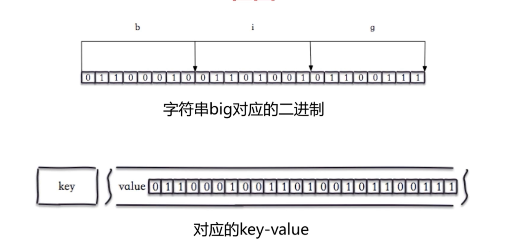
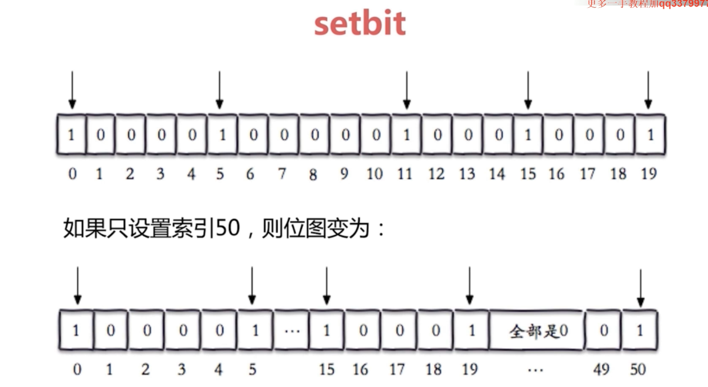

# Redis BitMap（位图）
&nbsp;&nbsp;BitMap，即位图，其实也就是 byte 数组，用二进制表示，只有 0 和 1 两个数字。

&nbsp;&nbsp;存储形式
- 

&nbsp;&nbsp;底层数据结构
- 底层数据结构是string

## 命令
1. set bit offset value: 给位图指定索引设置值。offset从0开始
    - 如果offset超过了长度:
       + 
2. getbit key offset: 获取位图指定索引位置的值
3. bitcount key [start end] : 获取位图指定范围(start 到end，单位为字节，若不指定就是获取全部)位值为1的个数

## 使用场景
### 1. 独立用户统计
#### 场景1. 一亿用户，5000W独立
|数据类型|每个 userid 占用空间|需要存储的用户量|全部内存量|
|---|---|---|---|
|set|32位（假设userid用的是整型，实际很多网站用的是长整型）|50,000,000|32位 * 50,000,000 = 200 MB|
|BitMap|1 位|100,000,000|1 位 * 100,000,000 = 12.5 MB|

#### 场景2.一亿用户，10W独立
|数据类型|每个 userid 占用空间|需要存储的用户量|全部内存量|
|---|---|---|---|
|set|32位（假设userid用的是整型，实际很多网站用的是长整型）|1,000,000|32位 * 1,000,000 = 4 MB|
|BitMap|1 位|100,000,000|1 位 * 100,000,000 = 12.5 MB|