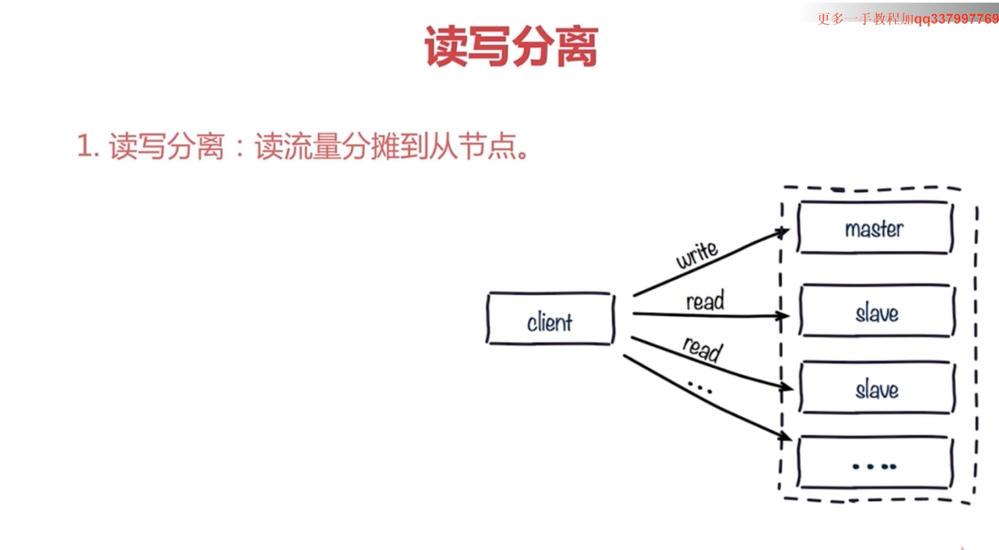

# Redis之主从复制
一个数据多个副本（一个master可以多个slave）
扩展读性能(读写分离，高可用,负载均衡)
一个slave只能有一个master
数据流是单向的，master到slave

## 复制命令
1. slaveof 

2. slaveof no one

## 配置
- slaveof ip port , 会将自己的数据清除，毕竟此时是别人的一个副本
- slave-read-only yes

## 请求方式

### 问题
1. 复制数据延迟
2. 读到过期时间
3. 从节点故障

### 主从复制的问题
1. 手动故障转移
    1. slaveof no one将slave转为master
    2. slaveof new master 将其他节点变为新master节点的从节点  
2. 写能力和存储能力受限
    - 写和存储都是在master节点上的，其他从节点都是复制master节点上的数据
