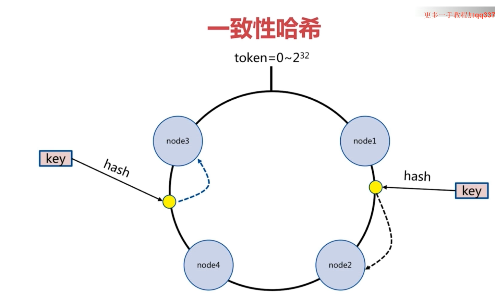
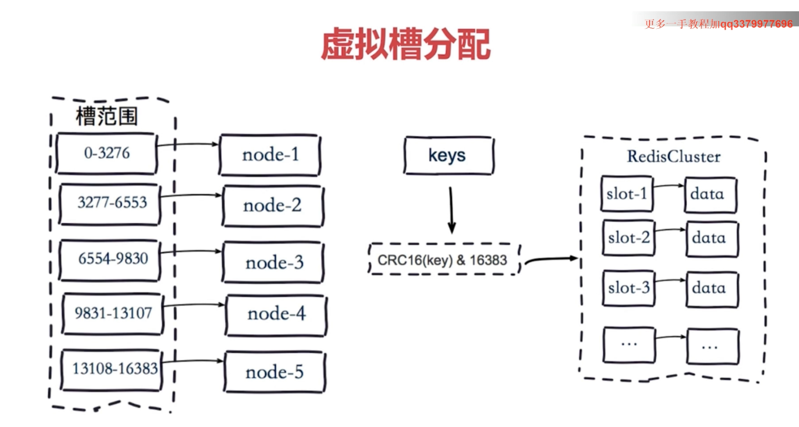
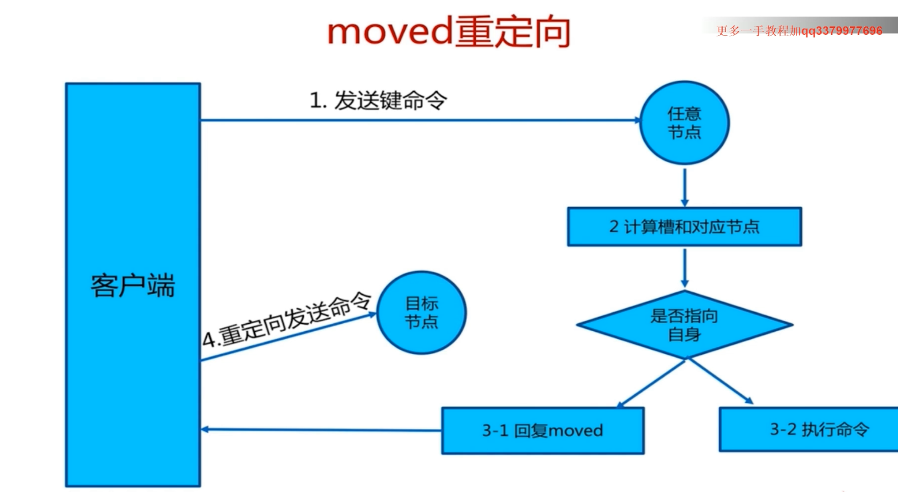
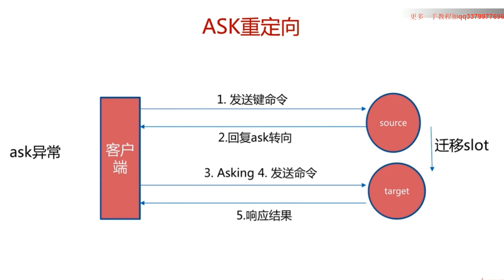

# Redis Cluster
&nbsp;&nbsp;为什么需要Clusterr
1. 并发量
2. 数据量

## 分区方式
#### 节点取余(hash(key)%nodes)
1. 问题（导致数据迁移）：
    - 当对节点数量进行拓展，由原来3个节点拓展为4个节点，那么所有的数据就都要重新分布了。（可能80%的数据需要迁移），此时可以采用多倍扩容的方式，若采用多倍扩容的方式，那么可能只需要迁移约50%的数据

#### 一致性哈希
&nbsp;&nbsp;降低数据的迁移量
1. 客户端分片方式： 哈希 + 顺时针(优化取余)
2. 节点伸缩： 影响邻近节点，但是还是有数据迁移
3. 翻倍扩容： 保证最小迁移数据和负载均衡

&nbsp;&nbsp;一致性哈希算法：
+ 

   1. 先计算key的hash值，例如hash值在node3，node4这个范围区间中
   2. 顺时针找离他最近的节点，将数据存到这个节点上。

#### 虚拟槽分区（Cluster默认）
1. 预设虚拟槽： 每个槽映射一个数据子集，一般比节点数大
2. 良好的哈希函数：如CRC16
3. 由服务端管理节点、槽、数据之间的关系

##### 虚拟槽分配
- 

### Redis Cluster特性
1. 复制
    - Redis Cluster是一个主从复制的，每个主节点都有一个从节点，主节点挂了，从节点会替代主节点进行服务。
2.  高可用
   - 主节点挂了，从节点会替代主节点进行服务。

3. 基于分片的
   - 每个主节点都可以读写

### 智能客户端

### Ask重定向和moved异常
#### moved异常
- 

   + 即调用set key value的时候，如果key对应的槽不在你所请求的节点上，会发送一个moved异常（此时并不会执行命令），此时就需要到key对应的槽所在的node上重新执行一次set key value操作

#### Ask重定向
> 在slot迁移时处理的
-  
