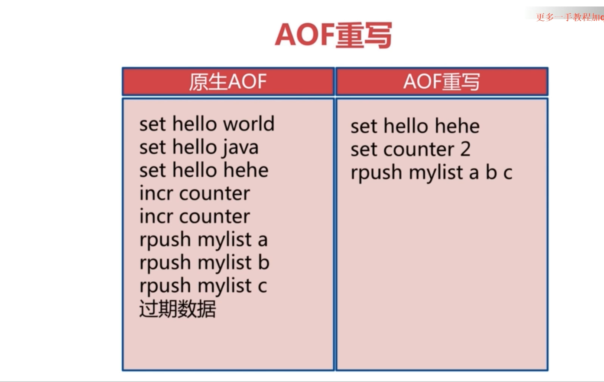
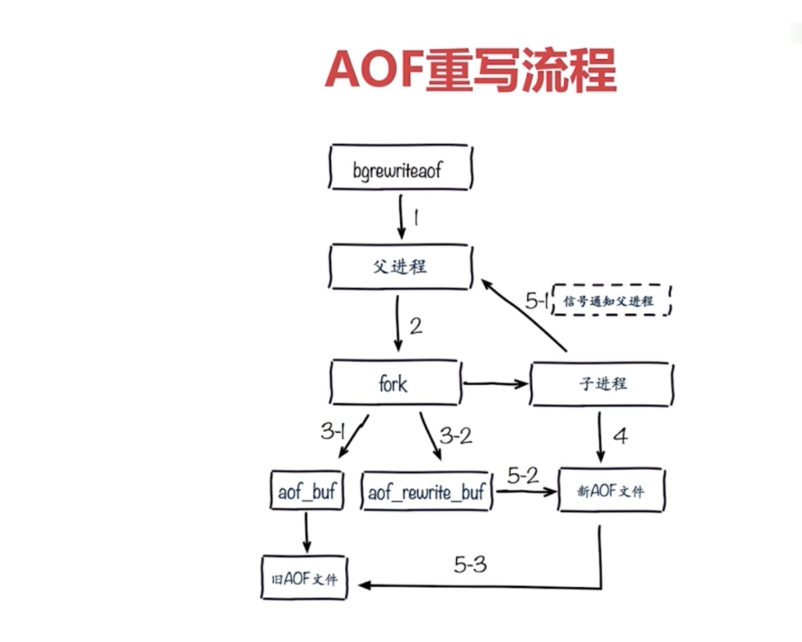

# Redis持久化
&nbsp;&nbsp;Redis将所有的数据保存在内存中，对数据的更新将异步地保存到磁盘上。

## 持久化方式
### RDB
&nbsp;&nbsp;Redis DataBase，是Redis内存到硬盘的快照，用于持久化。

#### 触发机制（新RDB文件替换旧RDB文件）
1. save： 同步，会阻塞其他命令执行
2. bgsave：异步（fork进程，使用这个新生的进程来持久化），先会生成一个临时文件，再使用临时文件替换rdb文件
3. 自动(save seconds changes)
    - save 900 1：若在900秒内，有1条数据发生改变，就会重新持久化一次。
    - save 300 10：若在300秒内，有10条数据发生改变，就会重新持久化一次。
    - save 60 10000： 若在60秒内，有10000条数据发生改变，就会重新持久化一次。
#### RDB的一些配置
```txt
stop-writes-on-bgsave-error yes ： bgsave出现错误是否停止写入（即Redis不执行命令了）
rdbcompression yes # RDB是否采用压缩格式
rdbchecksum yes ： 是否校验和检验
dbfilename dump.rdb
dir ./
```
#### RDB问题
1. 耗时耗性能
2. 会丢失数据

### AOF
&nbsp;&nbsp;通过日志来进行持久化

#### AOF持久化策略
1. always： 每条命令fsync到硬盘，不会丢失数据，但I/O开销大。
2. everysec: 每秒把缓冲区fsync到硬盘，每秒一次fsync，丢1秒数据。
3. no：由OS决定fsync

#### AOF重写机制
&nbsp;&nbsp;主要是解决随时间迁移，aof日志文件过大，这样也会导致服务器重启时启动慢的问题，即AOF重写的作用是：
1. 减少磁盘占用量
2. 加速恢复速度
##### AOF重写机制是什么



  + 相当于对命令进行化简

##### AOF重写实现方式
1. bgrewriteaof 
   - 

     + 如图，直接从Redis内存中重写到AOF文件中，而不是对旧AOF文件进行处理。

##### AOF配置
```txt
   appendonly yes : 打开aof
   appendfilename "appendonly-${port}.aof"： aof文件名
   appendfsync everysec：aof持久化策略
   no-appendfsync-on-rewrite yes:在AOF重写的时候，是否需要进行aof的append操作，这里表示不需要

   auto-aof-rewrite-percentage 100 : 增长率，AOF重写策略：AOF文件最小重写大小，只有当AOF文件大小大于该值时候才可能重写,4.0默认配置64mb
   auto-aof-rewrite-min-size 64mb：最小尺寸，AOF重写策略：当前AOF文件大小和最后一次重写后的大小之间的比率等于或者等于指定的增长百分比，如100代表当前AOF文件是上次重写的两倍时候才重写。　
```   

### RDB AOF对比
|命令|RDB|AOF|
|---|---|---|
|启动优先级|低|高(AOF RDB同时开启，优先使用AOF)|
|体积|小|大|
|恢复速度|快|慢|
|数据安全性|丢数据|根据策略决定|
|轻重|重(基于快照的，每次持久化均是全量持久化)|轻|

