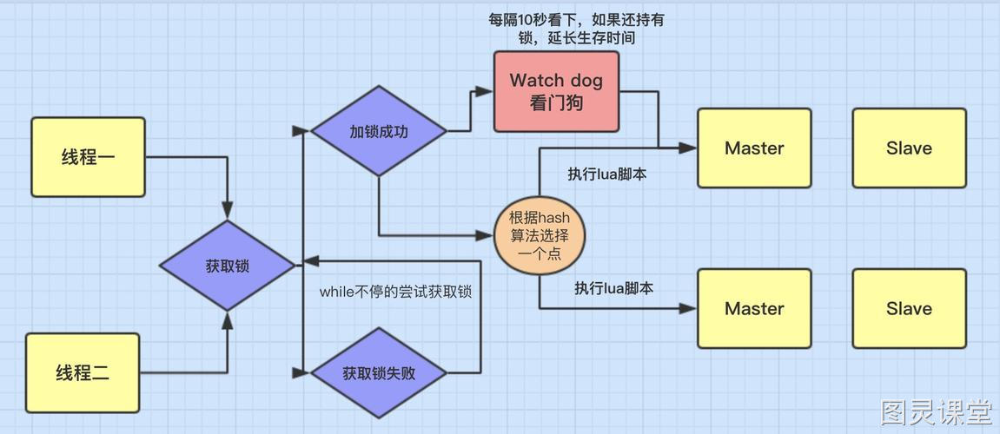

# 分布式锁实现方案
## 分布式锁特点
- 互斥性
- 可冲入性
- 锁超时
- 高效性
- 阻塞性： 支持阻塞获取和非阻塞获取两种方式
- 公平性：支持公平锁和非公平锁两种类型锁。


## 分布式锁实现方案
### 1. 基于Redis的分布式锁
加锁lua脚本
```lua
-- KEYS[1]代表的是加锁的Key，例如RLock lock = redisson.getLock("myLock")中的“myLock”；
-- ARGV[1]代表的就是锁Key的默认生存时间，默认30秒；
-- ARGV[2]代表的是加锁的客户端的ID，类似于下面这样的：8743c9c0-0795-4907-87fd-6c719a6b4586:1。


-- org.redisson.RedissonLock#tryLockInnerAsync
    -- 判断锁是否存在
    if (redis.call('exists', KEYS[1]) == 0) then  
        -- 添加所，并设置客户端和初始锁重入次数 
        redis.call('hincrby', KEYS[1], ARGV[2], 1);  
        -- 设置所的超时时间
        redis.call('pexpire', KEYS[1], ARGV[1]);  
        -- 加锁成功
        return nil;  
    end;  
    
    -- 判断锁的持有者是否是当前的请求者
    if (redis.call('hexists', KEYS[1], ARGV[2]) == 1) then  
       -- 当前锁再次被请求，重入次数+1
       redis.call('hincrby', KEYS[1], ARGV[2], 1);  
       -- 刷新锁的超时时间
       redis.call('pexpire', KEYS[1], ARGV[1]);  
       -- 返回加锁成功
       return nil;  
    end;  
    -- 返回当前锁的过期时间，表明被其他线程占有锁
    return redis.call('pttl', KEYS[1]); 
```


#### 看门狗逻辑
客户端1加锁的Key默认生存时间是30秒，如果超过30秒，客户端1还想一直持有这把锁，怎么办？ 只要客户端1加锁成功，就会启动一个watchDog看门狗，这个后台线程，会每隔10秒检查一次，若客户端1还持有锁Key，就会不断延长锁Key的生存时间。

##### 看门狗机制源码分析
```java
org.redisson.RedissonBaseLock#EXPIRATION_RENEWAL_MAP
 public void schedule() {
        if (!running.get()) {
            return;
        }

        long internalLockLeaseTime = executor.getServiceManager().getCfg().getLockWatchdogTimeout();
        executor.getServiceManager().newTimeout(this, internalLockLeaseTime / 3, TimeUnit.MILLISECONDS);
    }
内置调度期，在 ${key过期时间}/3 就会续期一次锁
```

#### Redisson 分布式锁缺陷
1. 在Redisson哨兵模式下： 客户端1都某个master节点写入了Redisson锁，此时会异步复制给对应的slave节点。但是这个过程中一旦发生master节点宕机，主备切换，slave节点变为了master节点。
   - 客户端2来加锁时，在新的master节点上也能加锁，此时会导致多个客户端对同一个分布式锁完成了加锁。

