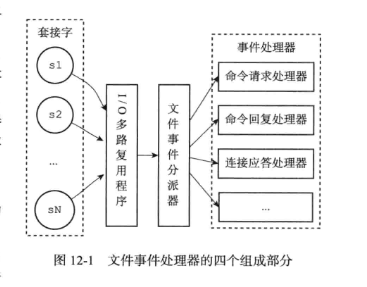

# Redis 工作模型
## Redis事件
&nbsp;&nbsp;Redis事件分为两类:
1. 文本事件
   > 服务器对套接字(客户端 或 服务端)操作的抽象
2. 时间事件
   > 服务器内部的<font color="red">定时操作</font>的抽象

## 文本事件
&nbsp;&nbsp;Redis基于Reactor模式开发了自己的网络事件处理器: 这个处理器被称为文本事件处理器。
- 文本事件处理器使用I/O多路复用程序来监听多个套接字，并根据套接字目前执行的任务来为套接字关联不同的事件处理器。
- 当被监听的套接字准备好执行连接应答(accept)、读取(read)、写入(write)、关闭(close)等操作时，与操作相对应的文本事件就会产生，这时文本事件处理器就会调用套接字之前关联好的事件处理器来处理这些事件。
  > <font color="red">**文本事件处理器**</font>以单线程方式运行，但通过使用I/O多路复用程序来监听多个套接字，文本事件处理器既实现了高性能的网络通信模型，又可以很好地与Redis服务器中其他同样以单线程方式运行的模块进行对接，这保持了Redis内部单线程设计的简单性。

### Redis 文本事件处理器
&nbsp;&nbsp;文本事件处理器由四部分组成: 套接字、I/O多路复用器、文本事件分派器、事件处理器
> 

&nbsp;&nbsp;文本事件是对套接字的抽象，每当一个套接字准备好执行连接应答(accept)、写入、读取、关闭等操作时，就会产生一个文本事件。<sub>因为一个服务器通常会连接多个套接字，所以多个文本事件有可能会并发地出现</sub>

#### Redis 单线程处理文本事件
&nbsp;&nbsp;I/O多路复用程序负责监听多个套接字，并向文本事件分派器传送那些产生了事件的套接字。

&nbsp;&nbsp;**每次处理一个套接字**：尽管多个文本事件可能会并发地出现，但I/O多路复用程序总是会将所有产生事件的套接字都放到一个队列中，然后通过这个队列，以有序、同步、每次一个套接字的方式向文本事件分派器传送套接字。当上一个套接字产生的事件被处理完毕之后，I/O多路复用程序才会继续向文本事件分派器传送下一个套接字。
> 

&nbsp;&nbsp;文本事件分派器接收I/O多路复用程序传来的套接字，并根据套接字产生的事件类型，调用相应的事件处理器<sup>事件处理器: 服务器会为执行不同任务的套接字关联不同的事件处理器。处理器是一个个函数，他们定义了某个事件发生时，服务器应该执行的动作。</sup>。

### 事件类型
&nbsp;&nbsp;I/O多路复用程序可以监听多个套接字的ae.h/AE_READABLE事件和ae.h/AE_WRITABLE事件，这两类事件和套接字操作之间的对应关系:
- 当套接字变得可读时，套接字产生ae.h/AE_READABLE事件
- 当套接字变得可写时，套接字产生ae.h/AE_WRITABLE事件

&nbsp;&nbsp;事件处理顺序<sub>一个套接字上</sub>：如果一个套接字同时产生AE_READABLE事件、AE_WRITABLE事件时，文本事件分派器会优先处理AE_WRITABLE事件，再处理AE_READABLE事件。


---

## 附录
### I/O多路复用程序的实现
&nbsp;&nbsp;Redis 的I/O多路复用程序的所有功能都是通过包装常见的select、epoll、evport和kqueue这些I/O多路复用函数库来实现的，每个I/O多路复用函数库在Redis源码中都对应一个单独的文件，如 ae_select.c、ae_epoll.c ...

&nbsp;&nbsp;Redis为每个I/O多路复用函数库都实现了相同的API，所以I/O多路复用程序的底层实现是可以互换的。

#### 自动选择I/O多路复用函数库<sup> #include实现、编译时选择</sup>
&nbsp;&nbsp; Redis 在I/O多路复用程序的实现源码中使用#include宏定义了相关规则，程序会在编译时自动选择系统中性能最高的I/O多路复用函数库来作为Redis I/O多路复用程序的底层实现：
```c
   // 001.REDIS_SOURCE_CODE/redis-6.2.5/src/ae.c
   /**
    *  Include the best multiplexing layer supported by this system.
    * The following should be ordered by performances, descending.
    * 
    * > 包括本系统支持的最佳多路复用层。以下内容应按性能降序排列。
    **/
   #ifdef HAVE_EVPORT
   #include "ae_evport.c"
   #else
       #ifdef HAVE_EPOLL
       #include "ae_epoll.c"
       #else
           #ifdef HAVE_KQUEUE
           #include "ae_kqueue.c"
           #else
           #include "ae_select.c"
           #endif
      #endif
   #endif
```

---

## 参考资料
1. 《Redis 设计与实现》