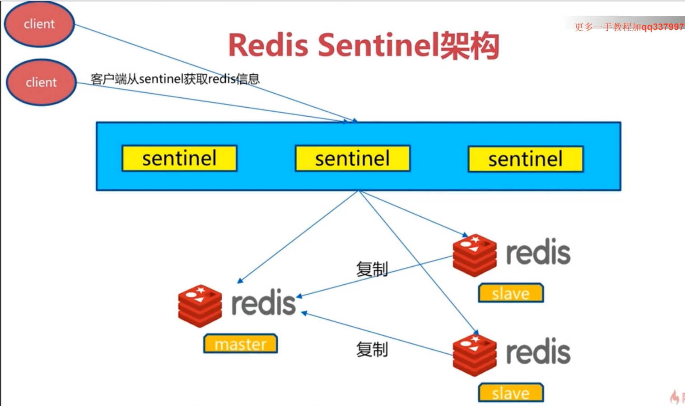

# Redis Sentinel
&nbsp;&nbsp; Redis Sentinel是Redis的高可用实现方案：
1. 故障发现
2. 故障自动转移
3. 配置中心
4. 客户端通知 

&nbsp;&nbsp;架构图:
- 

## 故障转移
1. 多个sentinel发现并确认master有问题
2. 选举出一个sentinel作为领导
3. 选出一个slave作为master
4. 通知其余slave成为新的master slave
5. 通知客户端主从变化
6. 等待老的master复活，但即使是复活了，他也只能称为新的master的slave节点

### 故障转移实现方式(sentinel领导者节点完成)
1. 从slave节点中选择一个合适的节点作为新的master节点
2. 对上面的slave节点执行slaveof no one命令让其称为新的master节点
3. 箱剩余的slave节点发送命令，让他们称为新master节点的slave节点，复制规则和parallel-syncs参数相关
4. 更新对原来master节点配置为slave，并保持对其关注，当其恢复后命令他去复制新的master节点

#### 选择合适的slave节点
1. 选择slave-priority(slave节点优先级)最高的slave节点，如果存在则返回，不存在则继续
2. 选择复制偏移量最大的slave节点（即复制最完整），如果存在则返回，不存在则继续。
3. 选择runid最小的slave节点