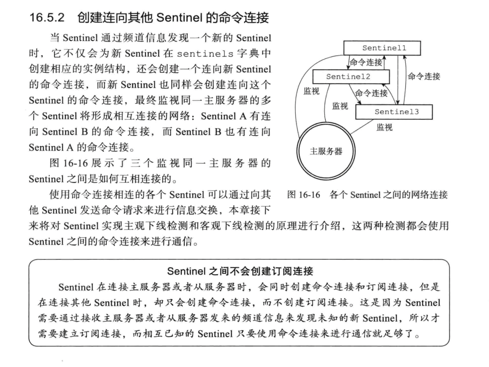
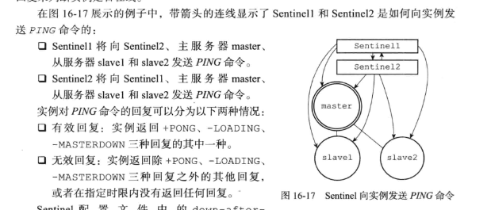

# REDIS SENTINEL
## 为什么需要Redis Sentinel？
&nbsp;&nbsp;了解过 主从复制 可以知道，当Master节点宕机时，Redis就不可用了，因为Master节点无法处理写命令，Replication节点无法更新数据。(Replication节点本身就无法处理写命令)

## 简介
&nbsp;&nbsp;Sentinel 是Redis的高可用性解决方案： 由一个或多个Sentinel实例组成的Sentinel系统可以监视任意多个主服务器，以及这些主服务器属下的所有从服务器，并在被监视的主服务器进入下线状态时，自动将下线的主服务器属下的某个从服务器升级为新的主服务器，然后由新的主服务器代替已下线的主服务器继续处理命令请求。
> 当已下线的主服务器再次上线时，此时会作为新的主服务器的从服务器。

## 启动并初始化Sentinel
### Command
```cmd
    wei@Wang:redis-sentinel /path/to/your/sentinel.conf
     or
    wei@Wang:redis-server  /path/to/your/sentinel.conf --sentinel
```

### 1. 初始化服务器
&nbsp;&nbsp;Sentinel 本质上就是一个运行在特殊模式下的Redis服务器，所以启动Sentinel的第一步，就是初始化一个普通的Redis服务器。但因为Sentinel执行的工作和普通Redis服务器执行的工作不同，所以Sentinel的初始化过程和普通的Redis服务器初始化过程并不相同:
- 普通服务器在初始化时会通过载入RDB文件或AOF文件来还原数据库状态，但Sentinel并不使用服务器，因此，Sentinel初始化时并不会载入RDB文件或AOF文件

### 2. 使用Sentinel 专用代码
&nbsp;&nbsp;即 将一部分普通Redis服务器使用的代码替换成Sentinel专用代码。
+ 普通Redis服务器使用redis.c/redisCommandTable作为服务器的命令表，而Sentinel则使用sentinel.c/sentinelcmds作为服务器的命令表

### 3.初始化Sentinel状态
&nbsp;&nbsp;服务器会初始化一个sentinel.c/sentinelState结构，这个结构保存了服务器中所有和Sentinel功能有关的状态.

### 4. 初始化Sentinel状态的masters属性
&nbsp;&nbsp;每个sentinelRedisInstance结构代表一个被Sentinel监视的Redis服务器实例，这个实例可以是主服务器、从服务器或另一个Sentinel.
- masters 字典的初始化是根据被载入的Sentinel配置文件来进行的。
  ```conf
     # master_1 configure
     sentinel monitor master_1 127.0.0.1 6379 2
     sentinel down-after-milliseconds master_1 30000
     sentinel parallel-syncs master_1 1
     sentinel failover-timeout master_1 180000
  
     # master_2 configure
     sentinel monitor mymaster_2 127.0.0.1 6380 2
     sentinel down-after-milliseconds mymaster_2 30000
     sentinel parallel-syncs mymaster_2 1
     sentinel failover-timeout mymaster_2 180000
  ```

### 5. 创建连向主服务器的网络连接
&nbsp;&nbsp;初始化Sentinel的最后一步就是创建连向被监视主服务器的网络连接，Sentinel将成为主服务器的客户端，可以向主服务器发送命令，并从命令中获取相关信息.

&nbsp;&nbsp;对于每个被Sentinel监视的主服务器来说，Sentinel会创建两个连向主服务器的异步网络连接:
1. 命令连接，专门用于向主服务器发送命令，并接收命令回复。
2. 订阅连接，专门用于订阅主服务器的__sentinel__:hello频道。
> 为什么需要两个异步连接: 在Redis目前的发布订阅功能中，被发送的信息都不会保存在Redis服务器中，如果在发送消息时，想要接收信息的客户端不在线或断线，那么这个客户端就会丢失这条消息。而为了不丢失__sentinel__:hello频道的任何信息，Sentinel必须专门用一个订阅连接来接收该频道的消息。

## 获取主服务器信息
&nbsp;&nbsp;Sentinel 默认会以10秒一次的频率，通过命令连接向被监视的主服务器发送INFO命令，并通过分析INFO命令的回复获取主服务器当前的信息:
- 主服务器本身的信息，包括run_id域记录的服务器运行ID以及role域记录的服务器角色。
- 主服务下所有的从服务器信息。

## 获取从服务器信息
&nbsp;&nbsp;当Sentinel发现主服务器有新的从服务器出现时，Sentinel除了会为了这个新的从服务器创建相应的实例结构外，Sentinel还会创建连接到从服务器的命令连接和订阅连接。

&nbsp;&nbsp;创建命令连接后，Sentinel在默认情况下，会以10秒一次的频率通过命令连接向从服务器发送INFO命令，并获得：
- 从服务器的运行ID run_id
- 从服务器的角色 role
- 主服务器的IP 端口
- 主从服务器的连接状态
- 从服务器的优先级
- 从服务器的复制偏移量

## 向主服务器和从服务器发送信息
&nbsp;&nbsp;默认情况下，Sentinel会以每2秒一次的频率，通过命令连接向所有被监视的主从服务器发送一些格式的命令:
```txt
    PUBLISH __sentinel__:hello "<s_ip>,<s_port>,<s_runid>,<s_epoch>,<m_name>,<m_ip>,<m_port>,<m_epoch>"

    # 两方面的信息:
    ## 1. Sentinel 的信息
    ## 2. 被监视的主服务器的信息
```

## [Sentinel间互相发现]·接收来自主服务器和从服务器的频道信息
&nbsp;&nbsp;当Sentinel与一个主服务器或从服务器建立起订阅连接后，Sentinel就会通过订阅连接，向从服务器发送以下命令:
```txt
    SUBSCRIBE __SENTINEL__:hello
```
&nbsp;&nbsp;Sentinel对__SENTINEL__:hello频道的订阅会一直持续到Sentinel与服务器的连接断开为止。
> 每个与Sentinel连接的服务器，Sentinel既通过命令连接向服务器的__sentinel__:hello频道发送消息，又通过订阅连接从服务器的__sentinel__:hello频道接收消息。
> > 对于监视同一个服务器的多个Sentinel来说，一个Sentinel发送的消息会被其他Sentinel接收到，__这些信息会被其他Sentinel对发送信息Sentinel的认知，也会被用于更新其他Sentinel对被*监视服务器*的的认知。__

### 更新sentinels字典
&nbsp;&nbsp;Sentinel为主服务器创建的实例结构中的sentinels字典除了保存Sentinel自身外，还有所有同样监视这个主服务器的其他Sentinel资料。

### 创建连向其他Sentinel的命令连接
&nbsp;&nbsp;当Sentinel通过频道信息发现一个新的Sentinel时，他不仅会为新Sentinel在sentinels字典中创建相应的实例结构，还会创建一个连向新Sentinel的命令连接，而新的Sentinel也同样会创建连向这个Sentinel的命令连接,最终监视同一个主服务器的多个Sentinel将想成相互连接的网络。如图:
- 

## 检测主观下线状态
&nbsp;&nbsp;在默认的情况下，Sentinel会以每秒一次的频率向所有与他创建了命令连接的实例(主服务器、从服务器、其他Sentinel)发送PING命令，并通过实例返回的PING命令回复来判断实例是否在线。

&nbsp;&nbsp;如下图，带箭头的线显示了Sentinel1和Sentinel2是如何向实例发送PING命令的：

- Sentinel1 将向Sentinel2、主服务器master、从服务器slave1,slave2发送PING命令。
- Sentinel2 将向Sentinel1、主服务器master、从服务器slave1,slave2发送PING命令。

&nbsp;&nbsp;实例对于PING命令的回复可以分为以下两种情况:
+ 有效回复: 实例返回+PONG 、 -LOADING 、 -MASTERDOWN 三种回复中的一种
+ 无效回复: 实例返回+PONG 、 -LOADING 、 -MASTERDOWN 三种回复之外的其他回复，或者在指定时间内没有返回任何回复

&nbsp;&nbsp;Sentinel配置文件中的down-after-milliseconds 选项指定了Sentinel判断实例进入主观下线所需要的时长： 如果一个实例在down-after-milliseconds毫秒内，连续向Sentinel返回无效回复，那么Sentinel会修改这个实例所对应的实例结构，在结构的flags属性中打开SRI_S_DOWN标识，以此来表示这个实例已经进入到了主观下线状态。
```txt
   down-after-milliseconds 不仅会被用来判断主服务器的主观下线状态，也会用来判断主服务器下所有的从服务器以及所有同样监视这个主服务器的其他Sentinel的主管下线状态。

   # 多个Sentinel设置的主管下线状态时长可能不同
   配置以自身配置为主，不用修改为同一个值。如:
   Sentinel1:
     sentinel monitor master 127.0.0.1 6379 2
     sentinel down-after-millseconds master 50000

   Sentienl2:
     sentinel monitor master 127.0.0.1 6379 2
     sentinel down-after-millseconds master 10000
   则 当master断线时长超过10000毫秒后，Sentinel2会将master判断为主观下线状态，而Sentinel1确认为master仍然在线。只有断线时长超过50000毫秒，Sentinel1才会认为master进入到了主观下线状态。
```