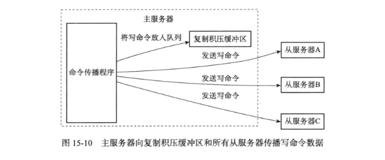

# 全量复制 or 部分复制
&nbsp;&nbsp;由于全量复制在主节点数据量较大时效率太低，因此Redis2.8开始提供部分复制，用于处理网络中断时的数据同步。

&nbsp;&nbsp;部分复制的实现，依赖于三个重要的概念：

### 复制偏移量
&nbsp;&nbsp;主节点和从节点分别维护一个复制偏移量（offset），代表的是主节点向从节点传递的字节数；主节点每次向从节点传播N个字节数据时，主节点的offset增加N；从节点每次收到主节点传来的N个字节数据时，从节点的offset增加N。

&nbsp;&nbsp;offset用于判断主从节点的数据库状态是否一致：如果二者offset相同，则一致；如果offset不同，则不一致，此时可以根据两个offset找出从节点缺少的那部分数据。例如，如果主节点的offset是1000，而从节点的offset是500，那么部分复制就需要将offset为501-1000的数据传递给从节点。而offset为501-1000的数据存储的位置，就是下面要介绍的复制积压缓冲区。

### 复制积压缓冲区
&nbsp;&nbsp;复制积压缓冲区是由主节点维护的、固定长度的、先进先出(FIFO)队列，默认大小1MB；当主节点开始有从节点时创建，其作用是备份主节点最近发送给从节点的数据。注意，无论主节点有一个还是多个从节点，都只需要一个复制积压缓冲区。

&nbsp;&nbsp;当主服务器进行命令传播时，他不仅会将写命令发送给所有的从服务器，还是将写命令入队到复制挤压缓冲区里。
> 

&nbsp;&nbsp;在命令传播阶段，主节点除了将写命令发送给从节点，还会发送一份给复制积压缓冲区，作为写命令的备份；除了存储写命令，复制积压缓冲区中还存储了其中的每个字节对应的复制偏移量（offset）。由于复制积压缓冲区定长且是先进先出，所以它保存的是主节点最近执行的写命令；时间较早的写命令会被挤出缓冲区。

&nbsp;&nbsp;由于该缓冲区长度固定且有限，因此可以备份的写命令也有限，当主从节点offset的差距过大超过缓冲区长度时，将无法执行部分复制，只能执行全量复制。反过来说，为了提高网络中断时部分复制执行的概率，可以根据需要增大复制积压缓冲区的大小(通过配置repl-backlog-size)；例如如果网络中断的平均时间是60s，而主节点平均每秒产生的写命令(特定协议格式)所占的字节数为100KB，则复制积压缓冲区的平均需求为6MB，保险起见，可以设置为12MB，来保证绝大多数断线情况都可以使用部分复制。

&nbsp;&nbsp;从节点将offset发送给主节点后，主节点根据offset和缓冲区大小决定能否执行部分复制：
  + 如果offset偏移量之后的数据，仍然都在复制积压缓冲区里，则执行部分复制；
  + 如果offset偏移量之后的数据已不在复制积压缓冲区中（数据已被挤出），则执行全量复制。

### 服务器运行ID(runid)
&nbsp;&nbsp;每个Redis节点(无论主从)，在启动时都会自动生成一个随机ID(每次启动都不一样)，由40个随机的十六进制字符组成；runid用来唯一识别一个Redis节点。通过info Server命令，可以查看节点的runid：

&nbsp;&nbsp;主从节点初次复制时，主节点将自己的runid发送给从节点，从节点将这个runid保存起来；当断线重连时，从节点会将这个runid发送给主节点；主节点根据runid判断能否进行部分复制：
+ 如果从节点保存的runid与主节点现在的runid相同，说明主从节点之前同步过，主节点会继续尝试使用部分复制(到底能不能部分复制还要看offset和复制积压缓冲区的情况)；
+ 如果从节点保存的runid与主节点现在的runid不同，说明从节点在断线前同步的Redis节点并不是当前的主节点，只能进行全量复制。
