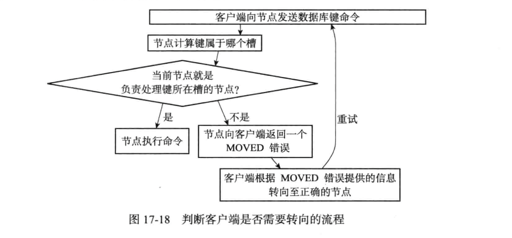

# 在Redis集群中执行命令
&nbsp;&nbsp;如[README.md](./README.md)所写明的一样，当slot都被分派好了的时候，那么集群就处于上线状态。

## MOVED 错误


&nbsp;&nbsp;当节点发现当前的slot并不是由自己处理的时候，那么就会给客户端抛出'MOVED'错误，指引客户端到处理该slot的节点:
```log
    # 错误格式
      MOVED slot <ip>:<port>
    ## stand alone (单例)模式下的redis-cli: 将MOVED错误抛出，不会自动重定向
    > ➜  redis-6.2.5 git:(master) ✗ ./src/redis-cli -p 6385   
      127.0.0.1:6385> get a 
      (error) MOVED 15495 127.0.0.1:6387
      127.0.0.1:6385> 
      << 那么这个时候需要客户端主动发送请求到节点 ’127.0.0.1:6387‘,不会自动重定向: 因为单例模式下的redis-cli无法理解MOVED错误.
    ---
    ## cluster (集群)模式下的redis-cli: 自动重定向，隐藏MOVED错误
     ➜  redis-6.2.5 git:(master) ✗ ./src/redis-cli -c -p 6385
     127.0.0.1:6385> get a 
     -> Redirected to slot [15495] located at 127.0.0.1:6387
     "aa"
     127.0.0.1:6387> 
```

## ASK 错误
### 重新分片
&nbsp;&nbsp;Redis集群的重新分片操作允许将任意数量的已经分配给节点A(源节点)的槽重新分派给新的节点B(目标节点)，并且相关槽的键值对也会从源节点迁移到目标节点。
> 重新分片操作可以在线执行，并且源节点和目标节点在执行过程中都可以处理命令。

### ASK 错误
&nbsp;&nbsp;在重新分片的期间，会出现这么一种情况: 属于被重新分片槽的数据一部分在源节点上，一部分在目标节点上，当客户端向源节点发送与数据库键有关的命令且键对应的槽正在处于重新分片状态时:
1. 源节点先在自身查找，若找到，则执行相关命令。
2. 源节点在自身没有找到键，那么源节点向客户端返回ASK错误，指引客户端向目标节点发送同样的命令。
   ```txt
      与MOVED错误一致，集群模式下的redis-cli在接收到ASK命令时会根据错误自动重定向到目标节点上并由目标节点执行命令。
   ```

### 重新分片操作
> <font color="red" style="font-weight:bold;">先迁移数据，再重新分派槽。</font>
```log
   > 
   # 重新分片之前
   127.0.0.1:6385> CLUSTER NODES
   b0f7a55dd044e2cfa27d7b2cba9fa4ae7233bf8d 127.0.0.1:6387@16387 master - 0 1686728051000 6 connected 0 10002-16383
   26982922399211bd899d844c0d65c00c17e9a0cd 127.0.0.1:6386@16386 master - 0 1686728051707 1 connected 5001-10000
   77eb2c630aed1fc0221afa4e8bc02c9cabe1409c 127.0.0.1:6385@16385 myself,master - 0 1686728050000 5 connected 1-5000 10001

   # 重新分派
   ➜  redis-6.2.5 git:(master) ✗ ./src/redis-cli --cluster reshard 127.0.0.1:6385 # 这个ip:port只是为了接入到集群
   >>> Performing Cluster Check (using node 127.0.0.1:6385)
   M: 77eb2c630aed1fc0221afa4e8bc02c9cabe1409c 127.0.0.1:6385
      slots:[1-5000],[10001] (5001 slots) master
   M: b0f7a55dd044e2cfa27d7b2cba9fa4ae7233bf8d 127.0.0.1:6387
      slots:[0],[10002-16383] (6383 slots) master
   M: 26982922399211bd899d844c0d65c00c17e9a0cd 127.0.0.1:6386
      slots:[5001-10000] (5000 slots) master
   [OK] All nodes agree about slots configuration.
   >>> Check for open slots...
   >>> Check slots coverage...
   [OK] All 16384 slots covered.
   How many slots do you want to move (from 1 to 16384)? 10
   What is the receiving node ID? 26982922399211bd899d844c0d65c00c17e9a0cd  # 设置目标节点
   Please enter all the source node IDs.
     Type 'all' to use all the nodes as source nodes for the hash slots.
     Type 'done' once you entered all the source nodes IDs.
   Source node #1: 26982922399211bd899d844c0d65c00c17e9a0cd
   *** It is not possible to use the target node as source node.
   Source node #1: 77eb2c630aed1fc0221afa4e8bc02c9cabe1409c    # 设置源节点
   Source node #2: b0f7a55dd044e2cfa27d7b2cba9fa4ae7233bf8d    # 设置源节点
   Source node #3: 26982922399211bd899d844c0d65c00c17e9a0cd    # 设置源节点: 节点不能既是目标节点，又是源节点，所以设置报错了。
   *** It is not possible to use the target node as source node.
   Source node #3: done
   
   Ready to move 10 slots.
     Source nodes:
       M: 77eb2c630aed1fc0221afa4e8bc02c9cabe1409c 127.0.0.1:6385
          slots:[1-5000],[10001] (5001 slots) master
       M: b0f7a55dd044e2cfa27d7b2cba9fa4ae7233bf8d 127.0.0.1:6387
          slots:[0],[10002-16383] (6383 slots) master
     Destination node:
       M: 26982922399211bd899d844c0d65c00c17e9a0cd 127.0.0.1:6386
          slots:[5001-10000] (5000 slots) master
     Resharding plan:
       Moving slot 0 from b0f7a55dd044e2cfa27d7b2cba9fa4ae7233bf8d
       Moving slot 10002 from b0f7a55dd044e2cfa27d7b2cba9fa4ae7233bf8d
       Moving slot 10003 from b0f7a55dd044e2cfa27d7b2cba9fa4ae7233bf8d
       Moving slot 10004 from b0f7a55dd044e2cfa27d7b2cba9fa4ae7233bf8d
       Moving slot 10005 from b0f7a55dd044e2cfa27d7b2cba9fa4ae7233bf8d
       Moving slot 10006 from b0f7a55dd044e2cfa27d7b2cba9fa4ae7233bf8d
       Moving slot 1 from 77eb2c630aed1fc0221afa4e8bc02c9cabe1409c
       Moving slot 2 from 77eb2c630aed1fc0221afa4e8bc02c9cabe1409c
       Moving slot 3 from 77eb2c630aed1fc0221afa4e8bc02c9cabe1409c
       Moving slot 4 from 77eb2c630aed1fc0221afa4e8bc02c9cabe1409c
   Do you want to proceed with the proposed reshard plan (yes/no)? yes
   Moving slot 0 from 127.0.0.1:6387 to 127.0.0.1:6386: 
   Moving slot 10002 from 127.0.0.1:6387 to 127.0.0.1:6386: 
   Moving slot 10003 from 127.0.0.1:6387 to 127.0.0.1:6386: 
   Moving slot 10004 from 127.0.0.1:6387 to 127.0.0.1:6386: 
   Moving slot 10005 from 127.0.0.1:6387 to 127.0.0.1:6386: 
   Moving slot 10006 from 127.0.0.1:6387 to 127.0.0.1:6386: 
   Moving slot 1 from 127.0.0.1:6385 to 127.0.0.1:6386: 
   Moving slot 2 from 127.0.0.1:6385 to 127.0.0.1:6386: 
   Moving slot 3 from 127.0.0.1:6385 to 127.0.0.1:6386: 
   Moving slot 4 from 127.0.0.1:6385 to 127.0.0.1:6386: 

   # 重新分片之后
   127.0.0.1:6385> CLUSTER NODES
   b0f7a55dd044e2cfa27d7b2cba9fa4ae7233bf8d 127.0.0.1:6387@16387 master - 0 1686728389484 6 connected 10007-16383
   26982922399211bd899d844c0d65c00c17e9a0cd 127.0.0.1:6386@16386 master - 0 1686728390518 7 connected 0-4 5001-10000 10002-10006
   77eb2c630aed1fc0221afa4e8bc02c9cabe1409c 127.0.0.1:6385@16385 myself,master - 0 1686728389000 5 connected 5-5000 10001
```

### ASKING 命令<sup>因: 重新分片，先迁移数据，再重新分派槽</sup>
&nbsp;&nbsp;一般情况下，客户端向节点发送关于槽i的命令的时候，而槽i又没有指派给这个节点的时候，那么节点就会给客户端返回一个MOVED错误。但是如果节点正在导入槽i，并且客户端带有REDIS_ASKING标志，那么节点就会破例执行关于槽i的命令一次。
```log
   127.0.0.1:6385> ASKING
   OK
   127.0.0.1:6385> get a
   -> Redirected to slot [15495] located at 127.0.0.1:6387
   "aa"
   127.0.0.1:6387> 
```

