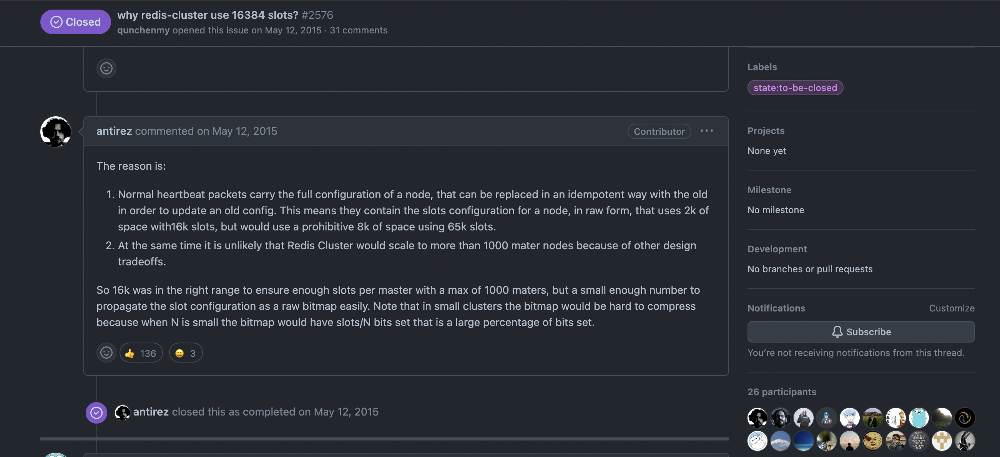

# Redis 集群

## 开启集群模式
&nbsp;&nbsp;一个Redis集群节点就是一个运行在集群模式下的Redis服务器，Redis服务器在启动时会根据cluster-ebabled配置选项是否为yes来决定是否开启服务器的集群模式.
```txt
    cluster-enabled yes
```

## CLUSTER MEET命令: 向集群中添加节点
&nbsp;&nbsp;通过向节点A发送 CLUSTER MEET 命令,客户端可以让接收命令的节点A将另一个节点B添加到节点A所在的这个集群中
```txt
   CLUSTER MEET <ip> <port>
```

## 槽指派
&nbsp;&nbsp;Redis集群通过分片的方式来保存数据库中的键值对：集群的整个数据库被分为16384个槽，数据库中的每个键都属于16384个槽中的一个，集群中的每个节点都可以[0,16384]（闭区间）个槽，且只要有一个槽未被指派处理，集群就处于下线状态。
```txt
   # 只要有一个槽未被指派处理，集群就处于下线状态:
     127.0.0.1:6385> cluster info
     cluster_state:fail
     cluster_slots_assigned:0
     cluster_slots_ok:0
     cluster_slots_pfail:0
     cluster_slots_fail:0
     cluster_known_nodes:3
     cluster_size:0
     cluster_current_epoch:2
     cluster_my_epoch:2
     cluster_stats_messages_ping_sent:37
     cluster_stats_messages_pong_sent:38
     cluster_stats_messages_meet_sent:2
     cluster_stats_messages_sent:77
     cluster_stats_messages_ping_received:38
     cluster_stats_messages_pong_received:39
     cluster_stats_messages_received:77
     127.0.0.1:6385> CLUSTER NODES
     26982922399211bd899d844c0d65c00c17e9a0cd 127.0.0.1:6386@16386 master - 0 1686217557644 1 connected
     2e11b6c7294177b845e4e6932267e1757e305d82 127.0.0.1:6385@16385 myself,master - 0 1686217555000 2 connected
     b0f7a55dd044e2cfa27d7b2cba9fa4ae7233bf8d 127.0.0.1:6387@16387 master - 0 1686217556608 0 connected
     127.0.0.1:6385> set a aaa
     (error) CLUSTERDOWN Hash slot not served
   
   ## 槽指派
   
```
### 为什么是16384个槽?


```txt
     The reason is:
     
     1. Normal heartbeat packets carry the full configuration of a node, that can be replaced in an idempotent(幂等) way with the old in order to update an old config. This means they contain the slots configuration for a node, in raw form(以原始形式), that uses 2k of space with16k slots, but would use a prohibitive（（费用或价格）高得令人望而却步的；限制性的，禁止的；） 8k of space using 65k slots.
     # 一般的心跳包携带着一个node的全量配置，这样就是一种幂等的方式来更新旧的配置。这意味着心跳包包含这个node关于slots的配置，在原始的形式中，使用2K的空间来传递16K个slot，但是使用8K空间来传递65K个槽的代价是令人望而却步的。
     2. At the same time it is unlikely（未必；难以相信） that Redis Cluster would scale to more than 1000 mater nodes because of other design tradeoffs.
     # 与此同时，因为其他因素的权衡，Redis集群的节点一般不会增长超过1000个节点。
     
     So 16k was in the right range to ensure enough slots per master with a max of 1000 maters, but a small enough number to propagate the slot configuration as a raw bitmap easily. Note that in small clusters the bitmap would be hard to compress because when N is small the bitmap would have slots/N bits set that is a large percentage of bits set.
     # 所以，16K个槽是一个合适的范围,确保每个最大1000个节点的集群种的每个node都有足够的slot。当数量足够小的时候，可以轻松将插槽配置转换为位图传输。请注意，在小数量节点的集群中，bitmap很难被压缩。

```

