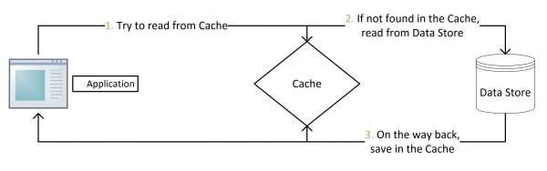

# 数据库和缓存一致性：缓存更新的套路
&nbsp;&nbsp;更新缓存的Design Pattern 有四种: Cache aside、Read Through、Write Behind Caching

## Cache Aside Pattern
&nbsp;&nbsp;最常用的模式，具体逻辑如下:
- 失效： 应用程序先从cache中取数据，没有得到，则从数据库中取数据，成功后，刷新到缓存中。
- 命中： 应用程序从cache中取数据，取到后返回。
- 更新： 先把数据存到数据库中，成功后，再让缓存失效注意，这里是让缓存失效，而不是更新缓存：防止两个并发的写操作导致脏数据。
  > 
    - 第3点： 即 从数据库中获取到数据后，在返回的时候，将数据刷新到缓存中
  > 

### 存在的问题
&nbsp;&nbsp;如，一个读操作，但是没有命中缓存，然后去数据库中读取数据，此时来了一个写操作，写完数据库后，让缓存失效，然后，之前的读操作再把老的数据放进去，所以，会造成脏数据。
> 解决方案: 