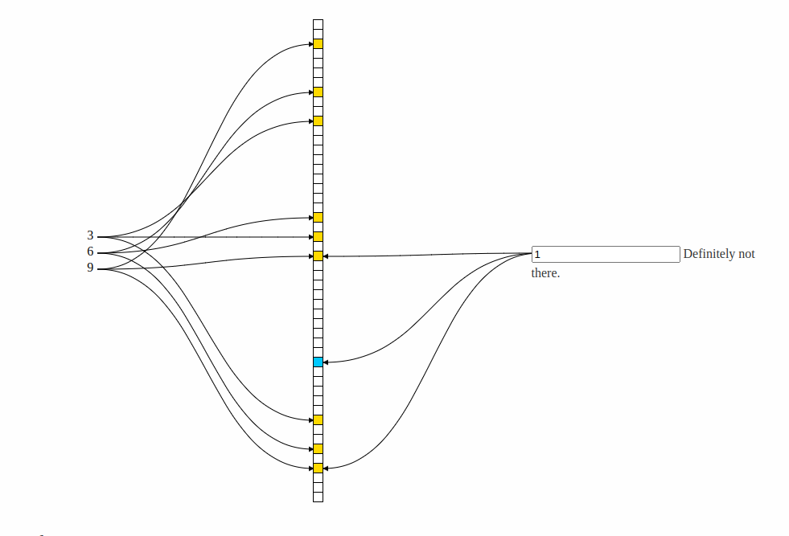

# Bloom Filter（布隆过滤器·概率数据结构）
&nbsp;&nbsp;基于Hash算法和位数组的数据结构,但该类型的数据结构并不存储数据本身(那么优势就是内存占用小),且该数据结构只能添加元素，不能删除元素。

## 什么是布隆过滤器
&nbsp;&nbsp;布隆过滤器是一种节省空间的概率数据结构，用于测试一个元素是否是集合的成员。
### Operations（操作）
&nbsp;&nbsp;The basic bloom filter supports two operations: test and add.
> 基础的Bloom Filter提供两个操作: test 及 add.

#### Test 操作
&nbsp;&nbsp;Test is used to check whether a given element is in the set or not. If it returns:
> Test操作被用于判断一个给定的元素是否在Set中，返回值代表的结果如下:
+ false then the element is definitely(adv.肯定地;当然;明确地;确定地;) not in the set.
  > false 表示这个元素肯定不存在Set中
+ true then the element is probably(adv.大概;或许) in the set. The false positive rate is a function of the bloom filter's size and the number and independence of the hash functions used.
  > true 表示这个元素<font color="red">可能</font>在Set中。误判率与布隆过滤器的大小以及所使用的哈希函数的数量和独立性有关。

#### Add 操作
&nbsp;&nbsp;Add simply adds an element to the set. Removal(n.移走;去掉;清除;开除;) is impossible without introducing false negatives, but extensions to the bloom filter are possible that allow removal e.g.(e.g. : 例如) counting filters.
> Add 简单地添加一个元素到Set中，在不影响判断结果的情况下无法删除元素。但是对bloom过滤器的扩展可以允许删除，例如计数过滤器。


### Applications(应用)
&nbsp;&nbsp;The classic example is using bloom filters to reduce expensive disk (or network) lookups for non-existent keys.
> 经典的用法是使用布隆过滤器减少对不存在的Key进行昂贵的磁盘或网络查找
>> 只是过滤掉一部分数据，还是不能精准判断(概率数据结构)

&nbsp;&nbsp;If the element is not in the bloom filter, then we know for sure we don't need to perform the expensive lookup. On the other hand, if it is in the bloom filter, we perform the lookup, and we can expect it to fail some proportion of the time (the false positive rate).
> 若元素不在布隆过滤器中，然后我们确定不需要执行高代价的查找。另一方面，如果元素在布隆过滤器中，那么需要执行查找，并且接受在一定比例内失败(误判率).

---
## 实现原理 && 插入原理

- 摘自: https://www.jasondavies.com/bloomfilter/

### 介绍
&nbsp;&nbsp;The bloom filter essentially(adv.本质上，根本上；大体上，基本上) consists of a bit vector of length m, represented by the central column.
> 布隆过滤器本质上由长度为m的向量组成，通过中间这个列代表.

&nbsp;&nbsp;<font color="red">【插入元素】</font>To add an item to the bloom filter, we feed(v.饲养;为...提供食物;) it to k different hash functions and set the bits at the resulting positions. In this example, I've set m to 50 and k to 3. Note that sometimes the hash functions produce overlapping(v.重叠；与……重合（overlap 的现在分词）) positions, so less than k positions may be set.
> 为了添加一个元素到布隆过滤器中，我们为布隆过滤器提供K种不同的哈希函数并且在向量(在Redis中，使用的是二进制数组)中设置哈希函数的结果对应的位置（如上图黄色的格子）.在这个例子中，我们选择了长度为50的向量以及3种哈希函数。需要注意的是有时候哈希函数会产生位置重叠，所以此时少于k个位置被设置.
>> 即，若存在k个哈希函数，那么在插入一个元素时，<= k 个位置会被设置(即K个位置变为黄色)

&nbsp;&nbsp;<font color="red">【检测元素是否存在】</font>To test if(conj.(表条件)如果;(表假设)要是;假如;即使;(用户间接疑问)是否;(用于礼貌)是否;当;尽管;就算;) an item is in the filter, again we feed it to the k hash functions. This time, we check to see if any of the bits at these positions are not set. If any are not set, it means the item is definitely not in the set. Otherwise(adv.否则，不然；除此以外，在其他方面；不同地，另外地；以其他方式，用别的方法;adj.不是那样的;另外情况下), it is probably in the set.
> 为了测试元素是否在过滤器中，我们再一次提供k个哈希函数。这一次，我们校验这些哈希函数结果对应的位置中的任意一个是否被设置，如果任意一个没有被设置，这意味着这个元素绝对不存在于Set中。否则，这个元素“或许”在Set中.

### 误判率计算公式
&nbsp;&nbsp;布隆过滤器是概率数据结构，有着一定的误判率，那么误判率如何计算呢?
- 计算器(可根据业务场景快速选择合适参数): [https://hur.st/bloomfilter/?n=100000&p=1.0E-3&m=&k=](https://hur.st/bloomfilter/?n=100000&p=1.0E-3&m=&k=)

- 公式变量:
   + m: 位数组长度
   + k: 哈希函数个数
   + n: 已添加元素数量
   + FPP: 误判率
#### 误判率计算公式(简单记录)
$$P_fp \approx
\begin{pmatrix}
   1 - e^{-\frac{kn}{m}}
\end{pmatrix} ^ k
$$

#### 位数组大小计算公式(简单记录)
$$m = 
-\frac{n\ln P_fp}{(\ln2)^2}
$$

---
## Redis 中的布隆过滤器
### [Bloom Filter commands](https://docs.redis.com/latest/modules/redisbloom/commands/#bloom-filter-commands)

|Command|Description|
|---|---|
|BF.ADD	|Adds an item to the filter.(添加一个元素到过滤器)|
|BF.EXISTS	|Checks if an item exists in the filter.(校验元素是否存在过滤器中)|
|BF.INFO	|Returns information about a Bloom filter.(返回布隆过滤器信息)|
|BF.INSERT	|Adds multiple items to a filter. If the key does not exist, it creates a new filter.(添加多个元素到过滤器，如果key不存在，那么就创建一个新的过滤器)|
|BF.LOADCHUNK	|Restores a Bloom filter previously saved with BF.SCANDUMP.(在使用BF.SCANDUMP前重置布隆过滤器)|
|BF.MADD	|Adds multiple items to the filter.(添加多个元素到过滤器)|
|BF.MEXISTS	|For multiple items, checks if each item exists in the filter.(多元素校验，判断每个元素是否存在于过滤器中)|
|BF.RESERVE	|Creates a Bloom filter. Sets the false positive rate and capacity.(创建一个布隆过滤器，设置误判率和容量)|
|BF.SCANDUMP|	Starts an incremental save of a Bloom filter.(开始一个Bloom过滤器的增量保存)|


---
## 使用场景
### 缓存类
1. 防止缓存穿透(查询一个根本不存在的数据，缓存层和数据库都不会命中。)
### 去重类
1. 网页爬虫对URL去重，避免爬取相同的URL。
   ```txt
               URL在过滤器中是否存在
                      /\
                     /  \
                不存在     存在
                   /      \
       一定没有爬取过,爬取   可能没有爬取过,可能爬取过(查库进一步判断)  
   ```
### 安全类(黑名单)
1. 反邮件垃圾，从数十亿垃圾邮件中判断某邮箱是否垃圾邮箱。
2. Chrome使用布隆过滤器识别恶意URL

---
## 参考资料
1. [介绍&&互动演示:https://www.jasondavies.com/bloomfilter/](https://www.jasondavies.com/bloomfilter/)
2. https://docs.redis.com/latest/modules/redisbloom/
3. [布隆过滤器计算器](https://hur.st/bloomfilter/)
4. https://www.bilibili.com/video/BV1Zz4y1Z71n?spm_id_from=333.337.search-card.all.click&vd_source=9eef164b234175c1ae3ca71733d5a727